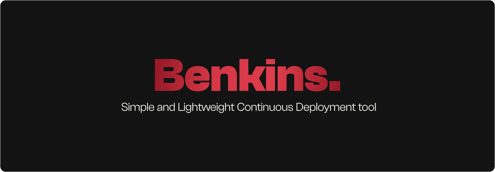

---
> [!IMPORTANT]  
> *Benkins* is in the alpha stage! Things are subject to change.
> Since the release of 0.2, the provided frontend is deprecated and will be replaced in a
> future release!

## Description
Benkins is a CI/CD tool made for checking and generating manufacturing files for ECAD applications.
When a new git tag is detected, *Benkins* will fetch the repo, run DRC checks and generate an archive with
the required files for manufacturing.


## Quick Start
1. Clone the repo and install the dependencies
```bash
git clone https://github.com/sebiTCR/BenkinsPrivate Benkins
cd Benkins
pip install -r requirements.txt
```

2. Generate your .env config 
```bash
./init_env.sh
```

4. Start the backend:
```bash
python app.py
```

5. Access it via http://localhost:5000
> [!NOTE]
> The frontend is used just for previewing already-existing projects. 
> For now, the communication will be made through a REST client

## 